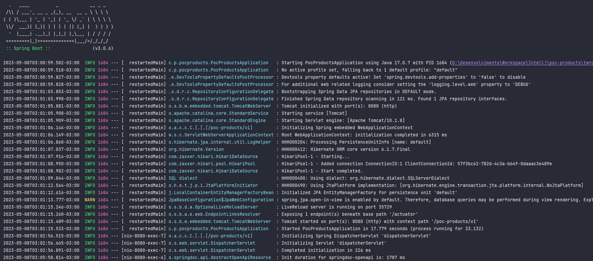
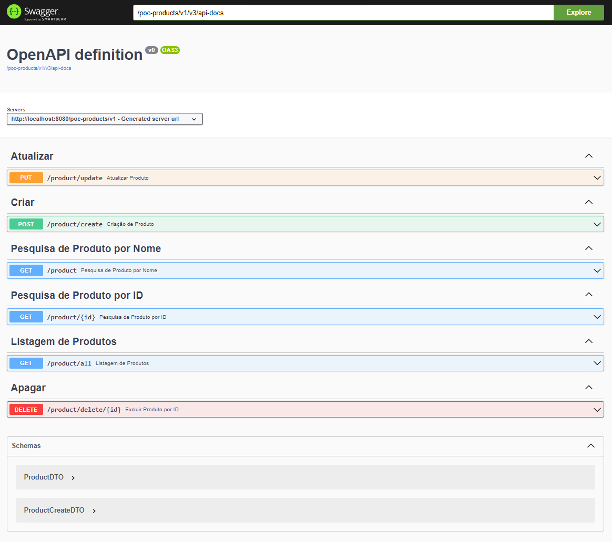
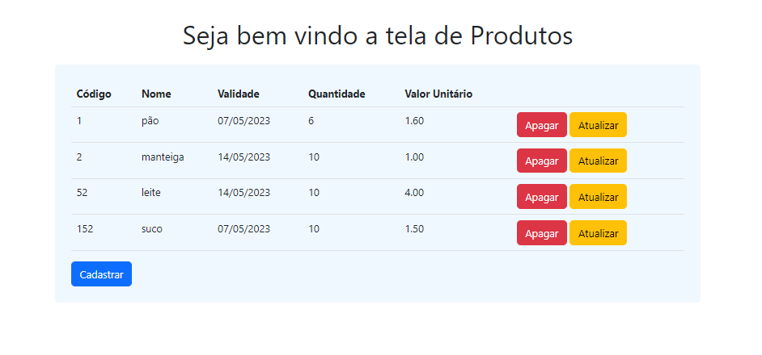
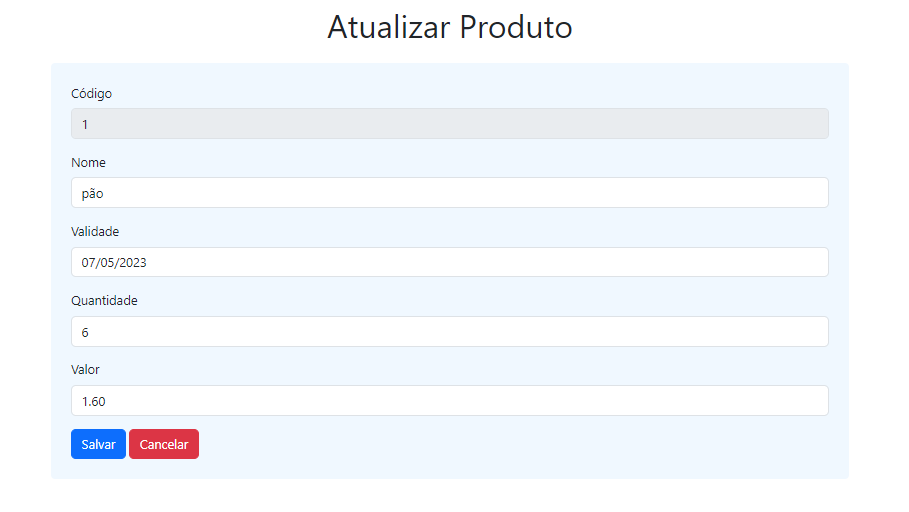
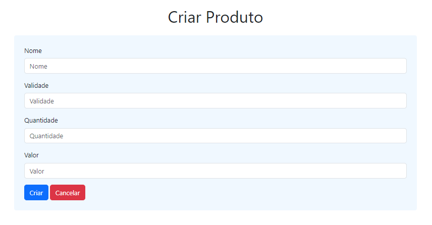
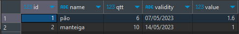

# Teste de Programação - CRUD Produtos  
Foi solicitado a crição de um CRUD para produtos, utilizando o SQL Server para o banco e o Thymeleaf para o front-end.

### Ferramentas Utilizadas
Para esse teste foi utlizado o Intellij, Spring-Boot, Spring JPA, Thymeleaf, Java 17, SQL Server e Docker.

### Regras para iniciar o projeto
A configuração do banco de dados foi feita via docker e para isso foi criado o arquivo: docker-compose.yml. 
1. Inicie o docker;
2. Clone o projeto em sua máquina;
3. Abra o projeto pelo Intellij;
4. Acesse o terminal do Intellij;
5. No terminal escreva o comando: docker-compose up -d, para criar o banco bancos;
6. Inicie o projeto no Intellij;

## Executando Aplicação

Evidencia de execução

### Health
* [Health Check](http://localhost:8080/poc-products/v1/actuator)

### [Documentação da API (Swagger)](http://localhost:8080/poc-products/v1/swagger-ui/index.html)

### Links das rotas do Front-end:
* [Home](http://localhost:8080/poc-products/v1/home)
* [Atualizar](http://localhost:8080/poc-products/v1/form-update/1) (O botão atualizar recupera o ID da linha que deseja atualizar)
* [Cadastrar](http://localhost:8080/poc-products/v1/create-form) 

### Evidencia dos registros no banco:

